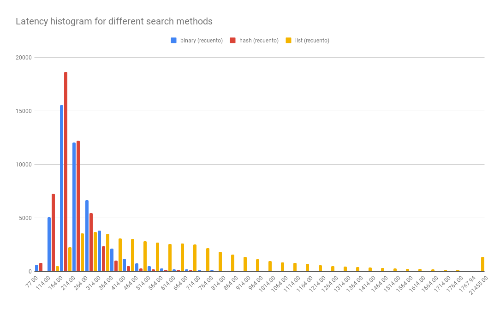

# tailatscale-java
A couple of programs to show how latency affects software. This is a java version of [Pablo's code](https://gist.github.com/pabloem/845d96e5142fbbbd1edd8512ac416fdf) which was inspired in the paper "[The Tail At Scale](https://research.google/pubs/pub40801/)"

The easiest way to compile and execute the programs is by using the Eclipse IDE.

__Server__ starts an http server (localhost:4567) that handles the following routes:

- /binary/:word : Search for :word in a dictionary using binary search
- /list/:word : Search for :word in a dictionary using linear search
- /hash/:word : Search for :word in a dictionary using a hash function

__Measure__ sends a bunch of http requests to __SERVER__ and generates a file out.csv that contains the latencies for each http request. The csv file can be used to generate a histogram that shows the "tail" in the distribution (see chart below).

